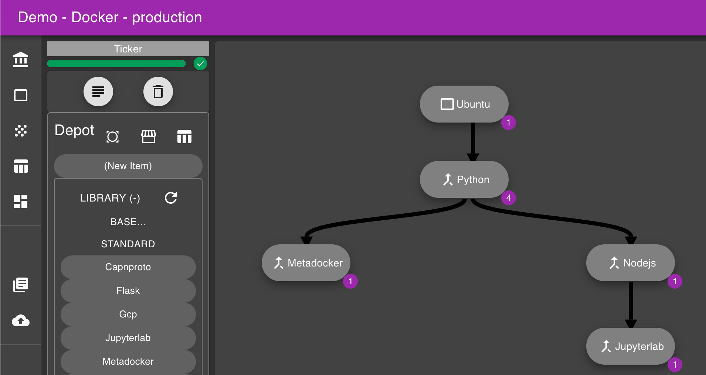

# Interface - A React Diagramming UI

### *Currently, a prototype app for controlling diagrammable processes*

I feel that many common software engineering tasks can be partly reduced to manipulating
some form of graph/network diagram. For example, a relatively complex data processing pipeline
might involve several data sources and 10s of operations, each of which could be 
represented as a vertex on a directed graph--and this would aid a creator or maintainer
in reasoning about the system. Many solutions already do incorporate some form of graph
visualization, yet these are rarely more than a static representation of the current state.
My thought is to make the graph the foundational UI piece and tie in any functionality to it.
With drag-and-drop manipulation, contextual feedback, and the ability to directly control the
underlying process, I believe the result would be powerful.

## Demo

[Click here](http://aleph.dereklarson.info/) to interact with a hosted instance.

> **Notes on Demo:** You can ignore the initial modal asking for Org info, just click outside, cancel, or fill in some cheeky garbage strings. Also keep in mind many of the features are placeholders, flaky or completely broken. But some things to try:
> * Drag library nodes from the Depot to various targets in the workspace
> * Drag nodes onto others in the workspace 
> * Click into nodes on the workspace, and take further actions
> * Use either the Docker or Pipeline context from the collapsible sidebar
> * Save and Load state checkpoints from the "cloud" buttons in the upper right

## Background

This is my first and only React app at present, but I tried to cobble together a set of best
practices and technologies.

* MaterialUI, Axios, Redux, React-DnD, Dagre, Ace editor
* Adhering to a JSX functional component style
* Initialized from Create React App (CRA)
* React Storybook used for component development
* Python Flask backend is in a separate private repo

## Quickstart

Dependencies: Node

* Clone the repository and `cd` into the directory
* Run `npm install` (populates your `node_modules/` based on `package.json`)
* Run `npm run start` to initiate the dev server
* Storybook stories available with `npm run storybook` 

## Structure

* Attempting to be a fairly standard JS-style repository
  * `src` contains all the authored code
    * `src/components` for visual UI components
    * `src/operations` for most anything axios related (calls to Flask)
    * `src/stories` for React storybook
  * `public` contains the boilerplate from CRA
  * `archive` has deprecated code lazily kept around for a limited duration
* Standalone files
  * The config file for Node: `package.json`
    * A proxy line has been added at port 3333 for serving requests during development
  * `config-overrides.js` used by react-app-rewired to allow path shortcuts
    * e.g. @diagram for src/components/diagram  
  * TODO  `jsx_style.md` covers style
